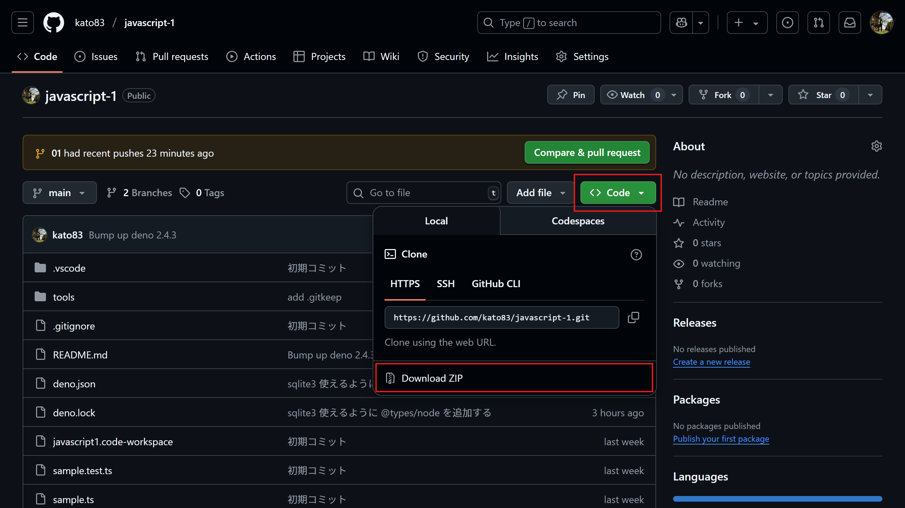

# JavaScript 1

## セットアップ

### 開発プロジェクトのダウンロード



1. この [kato83/javascript-1](https://github.com/kato83/javascript-1/tree/main) 開発プロジェクト（リポジトリ）のソースコードをZIPでダウンロードしてください。
2. ZIPでダウンロードできたファイルはデスクトップ上で解凍してください。
3. PC上でJavaScriptをブラウザ無しで扱えるようにするため [Release v2.4.3 · denoland/deno](https://github.com/denoland/deno/releases/tag/v2.4.3) より [deno-x86_64-pc-windows-msvc.zip](https://github.com/denoland/deno/releases/download/v2.4.3/deno-x86_64-pc-windows-msvc.zip) をダウンロードし、ZIPファイルの中にある `deno.zip` を `tools/` 直下（つまり `./tools/deno.exe` となるよう）に配置してください。
4. 解凍したフォルダの直下にある `javascript1.code-workspace` をダブルクリックで開き、Visual Studio Code（以下VSCode）が起動することを確認してください。
    1. 万が一開けない場合はVSCodeを開いてから、VSCode上で `javascript1.code-workspace` を開いてください。
5. VSCodeのメニューバーの `ターミナル > 新しいターミナル` よりターミナルを開き、以下コマンドが正常に返却されるかを確認してください。
    1. 正常に動作しない場合はフォローします。

```
> deno --version
```

上記を実行し、以下のような値が帰ってくれば成功。

```
> deno --version
deno 2.4.3 (stable, release, x86_64-pc-windows-msvc)
v8 13.7.152.14-rusty
typescript 5.8.3
```

## ディレクトリ構成

- `.vscode/`
  - `extensions.json` : VSCode で使用する拡張機能を列挙したファイル
  - `launch.json` : 
  - `profile.ps1` : PC上で `deno` コマンドを実行するためのセットアップファイル
- `.gitignore` : Git で管理しない資材をパス文字列で記述したファイル
- `docs/` : 授業資料と演習課題
  - `01/` ... `13/` : コマ毎の授業資料と演習課題
  - `01-answer/` ... `13-answer/` : コマ毎の演習課題模範回答
- `tools/` : ツール郡
  - `.gitkeep` : `tools/` ディレクトリを Git 資材にするためのファイル
  - `deno.exe` : JavaScript ランタイム Deno 本体（以下のセットアップ参照）
- `deno.json` : JavaScript ランタイム Deno の設定ファイル
- `deno.lock` : JavaScript ランタイム Deno のロックファイル
- `javascript1.code-workspace` : VSCode を開くためのファイル
- `README.md` : 当ドキュメントファイル

## JavaScript ランタイム Deno の利用方法例

```
> deno test
> deno run sample.ts
```

## Deno について

**[Deno（ディーノ又はデノ）](https://github.com/denoland/deno)** は、JavaScriptやTypeScriptという言語を使ってプログラムを動かすための「実行環境（ランタイム）」です。これは、パソコンやスマホの中でプログラムがちゃんと動くように助ける"土台"のようなものです。

Denoを作ったのはRyan Dahl（ライアン・ダール）という方で、彼は以前に「Node.js（ノードジェイエス）」という有名な実行環境も作った人物です。ただ、Node.jsにはあとから気づいたいくつかの問題があり、それを直したより新しい形としてDenoを作りました。

※DenoはNodeのアナグラムです。

Denoはセキュリティに気をつけていて、危険な操作は自動ではできないようになっています。また、特別な設定をしなくてもTypeScriptという便利な言語が使えます。シンプルで安全に使えるように工夫されているのが特徴です。

※今回はJavaScriptの拡張言語のTypeScriptは使用せずにJavaScriptを利用します。

> [!NOTE]
> 先発のNode.JSに比べ後発のDenoの方が良さそうに思えますが、以下調査の通りNode.JSがJavaScriptランタイムとして圧倒的なシェアを誇っています。  
> [State of JavaScript 2024: そのほかのツール](https://2024.stateofjs.com/ja-JP/other-tools/#runtimes)  
> 今回は学校のPCにNode.JSがインストールされていないことや、セットアップが簡単なことを理由にDenoを用いてJavaScriptの学習を進めていきます。  
> Denoの独自の記述も授業後半で出てくるので、都度資料にも追記、口頭によるフォローを入れていきますのでご安心を。

