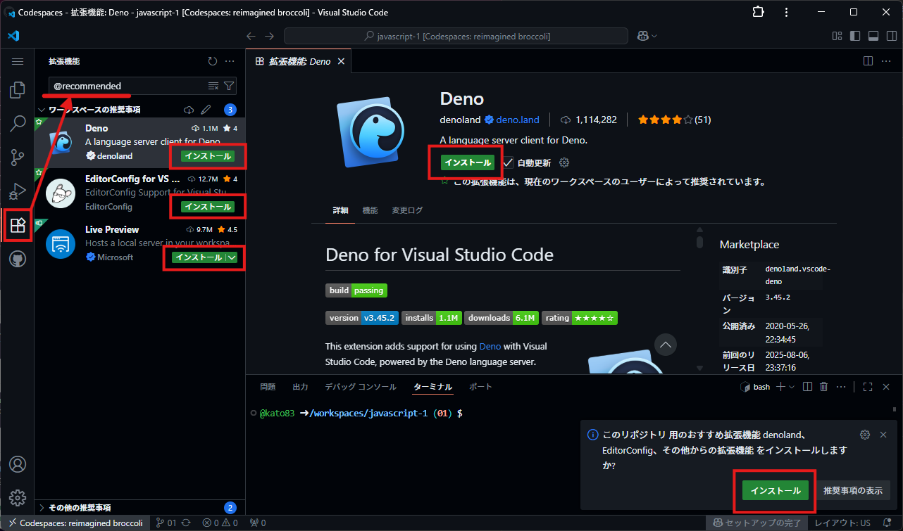

# JavaScript 1 イントロ

## 自己紹介

### 名前

**加藤 友樹 (Yuki Kato)**

### 経歴

- 2013-04～2016-03 埼玉県内の情報処理系の高校を卒業
- 2016-04～2018-03 東京電子専門学校 ウェブ・メディア科を卒業
- 2018-04～2023-04 都内WEB制作会社に新卒入社し開発部に所属
- 2023-07～ 株式会社セキュアスカイ・テクノロジーに中途入社しEASM事業部に所属
- 2024-04～ 東京電子専門学校非常勤講師を務める

主に開発業務全般を生業とし、現在はセキュリティ系のSaaSの開発に
従事しています。

### 主な使用言語

TypeScript, JavaScript, Java, PHP, Scala, Python

### 趣味
ダーツ🎯 原神🎮️

時間があれば小説、専門書など本を読み漁ったりすることも。

## 授業のスタイル

**プログラミング言語は書いて覚えるもの、座学は最低限に。**

わからない！忘れた！って箇所があったら詳しくフォローや説明
をしていきます。

なるべく開発で活きる内容をピックアップしていくつもりなので「これ将来役立つの……?」みたいに斜に構えず覚えていきましょう!

## 資料など

- 資料
  - 演習課題を含め当リポジトリ [kato83/javascript-1](https://github.com/kato83/javascript-1) に格納していきます。
- 補助教材
  - [JavaScript[完全]入門 | 柳井政和](https://www.amazon.co.jp/dp/481560763X)
- **参考サイト**
  - **[開発者向けのウェブ技術 | MDN](https://developer.mozilla.org/ja/docs/Web)**
  - **困ったらまずはこのサイトを見よう**

# JavaScriptとはどのような言語か

## JavaScript=JS

**JavaScript** の略称として **JS** を用います。  
**JavaScriptとJavaは別物です!**

## ブラウザ上で動く唯一の言語かつサーバー上でも使用できる言語

プログラミング言語毎に得意不得意はあるが、大抵のプログラミング言語でできることはJavaScriptでもできる。

- サーバーやクライアント間でのデータ送受信
  - WEBサーバー
  - DBサーバー
  - メールサーバー
  - API通信
- ファイル読み込み&書き込み
- などなど

## プログラムの表示と中身の開発がJSのみで完結する

### Q. プログラムの基礎は覚えたけど、実際にプロダクトとしてユーザー広く使ってもらうようなアプリケーションを展開するには？

### A. HTML CSS JSを用いたWEBアプリケーションを開発するのが比較的容易

※前提不足もあるが、最も手軽かは別の話。

ブラウザさえ動く環境であれば **HTML, CSS, JS** を用いた画面を作成し、 **サーバー内部で動くプログラムもJS** で作れば、 **学習コストも少なく表示画面を作り込んだマルチプラットフォームなアプリケーション開発が可能** 。

## ⚠️JSだけ覚えればいいというわけではない

プログラム言語ごとに得意な領域、不得意な領域が存在する。  
それぞれの言語の特徴を理解したうえで適切な選択が求められる。

例）スクリプト言語, コンパイラ言語, スループット, 学習コスト, 拡張性, 機能要件, セキュリティ等々加味した堅牢性, ライブラリの充実度, エコシステム, アップデート頻度, 将来性, 等々

## 今回はなぜJS？

- 学習コストが低い
- とても手軽
- 将来的に活かせたり、役立つ場面も多い
  - JavaScriptを拡張して作られたサービスとかもある
    - Google Apps Script
    - Microsoft Office Scripts

# プログラミングを学ぶ前にVSCodeを使いこなそう

## なぜ最初にエディタ？

多くの場合、プログラミング作業の大部分はコードを書くことだと思われがちですが、実際はそうではありません。

**編集・検索・移動・確認** もコードを書く時間に並ぶ程度時間を消費します。

もしエディタ操作が遅いままだと……

- コードを探すのに時間がかかる
- エラー箇所にたどり着くのが遅い
- 調べ物に余計な労力がかかる

結果として「わからない時間」や「待ち時間」が増え、学習効率が下がります。

## VSCodeはプログラマーの必須ツール

VSCodeは、ただのテキストエディタではありません。

- **筆記用具**: コードを書く
- **辞書**: 関数や変数の場所を即検索
- **工場**: ビルド・実行・デバッグが一発でできる

1つの画面でこれら全部ができるからこそ、 **使いこなせると学習速度が一気に上がる** のです。

## 使いこなすと何が変わるか

### 検索と置換

- **初心者**: ファイルを1つずつ開いて目で探す → 数十分
- **熟練者**: `Ctrl + Shift + F` で一括検索 → 数秒

### エラー修正

- **初心者**: エラー行番号を見て、手で該当ファイルを探す
- **熟練者**: エラー一覧からクリック一発で該当箇所へ

## 練習なしでは覚えられない

- タイピング練習と同じで、VSCode操作も **手で繰り返す** ことで身につく
- 操作に迷っている時間は、そのまま学習スピードのロスになる
- **「速く書く」より「速く操作する」ことが大事**

## VSCode操作を覚える

1. 拡張機能のインストール及び使い方
2. キーボードショートカット
3. 一括検索と置換
4. コード整形（Format Document）
5. ターミナルでの実行
6. デバッグとブレークポイント設定

### 1. 拡張機能のインストール及び使い方

VSCodeでは標準でJavaScriptの開発機能は備わっていますが [ルートディレクトリのREADME.md](../../README.md) に記載した通り **Deno** というJavaScriptランタイムを利用するため、そのランタイム専用の便利機能をエディタでも解釈できるようにするための拡張機能と、その他入れておきたい複数の拡張機能をインストールします。

| 拡張機能名 | 機能説明 |
| --- | --- |
| **Deno** | JSのランタイムDenoの開発プラグイン |
| **EditorConfig for VS Code** | エディタを問わずファイルやコードのフォーマットを一貫させるためのプラグイン |
| **Live Preview** | VSCodeで開いたHTMLファイルを確認するための即席HTTPサーバーを起動してくれるプラグイン |

以下のキャプチャの通り、画面左のアクティビティバーの **拡張機能** より表示される検索窓で `@recommended` と入力し、候補として表示される拡張機能を全てインストールしてください。



※VSCodeの右下にポップアップで拡張機能をインストールするかの確認が表示されている場合、それを押下してインストールでもOKです。

ルートディレクトリの `sample.ts` を開き `Deno.` と入力し、コード補完が表示されることを確認してください。


### 2. キーボードショートカット

VSCodeは多くのエディタで共通のキーボードショートカットとVSCode独自のキーボードショートカットが存在します。

VSCodeの全てのショートカットは画面左のアクティビティバーの下にある歯車アイコン（管理）から `キーボードショートカット` 又は `Ctrl + K Ctrl + S` 押下により確認することができます。

#### デフォルト時

| ショットカットキー | 動作 |
| --- | --- |
| `Ctrl + N` | 新しいファイルの作成 |
| `Ctrl + S` | 開いているファイルの保存 |
| `Ctrl + W` | 開いているファイルを閉じる |
| `Ctrl + E` | ファイル移動及び開く |
| `Ctrl + G` | 開いているファイルの行移動 |
| `Ctrl + F` | 開いているファイル内の文字列検索 |
| `Ctrl + H` | 開いているファイル内の文字列置換 |
| `Ctrl + Shift + F` | 開いているプロジェクト全体の文字列検索 |
| `Ctrl + Shift + H` | 開いているプロジェクト全体の文字列置換 |
| `Ctrl + TAB` <br/> `Ctrl + Shift + TAB` | タブ内の開いているファイルの切り替え |
| `F1` | コマンドパレットの表示（ここから追加の操作を実行できる） |

#### エディタ編集時

| ショットカットキー | 動作 |
| --- | --- |
| `Ctrl + A` | コードの全体選択 |
| `Ctrl + Z` | 操作を戻す |
| `Ctrl + Shift + Z` | 操作を戻した操作を進める |
| `Ctrl + X` | 選択範囲を切り取り |
| `Ctrl + C` | 選択範囲をコピー |
| `Ctrl + V` | カーソル位置でペースト |
| `Ctrl + (↑↓←→)` | 単語間カーソル移動 |
| `Shift + (↑↓←→)` | テキスト選択&カーソル移動 |
| `Ctrl + Shift + (↑↓←→)` | テキスト選択&単語単位カーソル移動 |
| `Home` | 行頭移動 |
| `End` | 行末移動 |
| `Ctrl + Alt + F` | コードフォーマット |
| `Ctrl + D` | 同一単語選択 |
| `Ctrl + Alt + (↑↓←→)` | マルチカーソル選択 |
| `Ctrl + U` | 選択取り消し |
| `F2` | 選択中の変数名の置換 |

### 3. 一括検索と置換

プログラムが複数のファイルに分かれている場合、 **特定の文字や関数を一度に探したい** ことがあります。  
手作業で1ファイルずつ開いて探すのは時間がかかるため、 **一括検索** を使うと効率的です。  
また、複数箇所の文字列をまとめて変更したいときは **一括置換** が役立ちます。

#### プロジェクト全体で検索

1. `Ctrl + Shift + F` で検索パネルが画面左に開く
2. 検索したい文字列を入力
3. **Enter** で結果一覧を表示
4. 該当箇所をクリックすると、その位置へジャンプ

#### プロジェクト全体で置換

1. `Ctrl + Shift + H` で検索パネル右側に置換入力欄が表示される
2. 置き換えたい新しい文字列を入力
3. 個別に置換 : 該当箇所右の **置換アイコン** をクリック
4. 全部置換 : パネル上部の **「すべて置換」** ボタンをクリック

> [!WARNING]
> 一括置換は元に戻せない場合があります。  
> 必ず置換前に結果を確認してから実行しましょう。

#### ファイル内のみで検索・置換
- **検索**: `Ctrl + F`
- **置換**: `Ctrl + H`

#### 実習課題

1. プロジェクト内で同じ単語（例: `console.log`）を探す  
   → `Ctrl + Shift + F` を使って一覧表示
2. 検索結果の中から1つをクリックして該当箇所に移動
3. `Ctrl + Shift + H` を使って、任意の単語を別の文字列に一括置換してみる
4. 誤置換を防ぐために、 **置換前に結果を目視確認** する


> [!TIP]
> - 検索は **部分一致** と **完全一致** を切り替えられます（ `.*` や `Aa` アイコン等で設定）
> - 大規模な修正では **Gitで差分を確認しながら置換** すると安全
>   - ※JavaScript 1 の授業ではGitは取り扱いません
> - 置換は取り返しがつかない場合があるので、慎重に行う

### 4. コード整形（Format Document）

コードは人間が読むための文章でもあります。  
インデントやスペースのズレがあると、 **読みづらくバグの原因にもなります** 。

**コード整形（フォーマット）** を使えば、自動で整った見た目にそろえてくれます。

#### 基本操作

1. 整形したいファイルを開く
2. `Shift + Alt + F` を押下
3. インデントやスペース、改行などが自動で修正される

#### 右クリックから整形する方法

1. ファイル上で右クリック
2. `ドキュメントのフォーマット` を選択

#### デフォルトフォーマッタの設定確認

1. `Ctrl + ,` で設定を開く
2. `default formatter` と検索

> [!NOTE]
> 既に `javascript1.code-workspace` ファイルでコードの自動整形設定を適応しています。
> VSCodeでもいくつかのフォーマット（拡張子）の自動整形に対応していますが、今回はDenoの機能を用いてJavaScript, TypeScript, JSON(C)のフォーマットを行うような設定に変更しています。

#### 保存時に自動整形する設定（実施済み）

> [!NOTE]
> 既に `javascript1.code-workspace` ファイルでコードの自動整形設定を適応しています。
> `*.code-workspace` に設定をJSON形式で保存することによって、開発者間でのコーディングルールのズレを防ぐことが可能になります。

1. 設定を開き `format on save` と検索
2. `Format On Save` にチェックを入れる
3. 保存（ `Ctrl + S` ）するたびに自動で整形されるようになります

#### 実習課題

1. インデントをわざと崩したコードを書いてみる
2. `Shift + Alt + F` で整形する
3. 追加で更にインデントをわざと崩したコードを書いてみる
4. 保存時自動整形（Format On Save）が機能しているか試す

#### ポイント

- 整形は **コードの動作を変えず、見た目だけをそろえます**
- チーム作業では、コード整形を統一すると差分が見やすくなります
- 自動整形を有効にしておくと、コードレビューで「インデント直して」が減ります

### 5. ターミナルでの実行

#### なぜ使うのか

プログラムは、書いただけでは動きません。

**ターミナル** を使ってコマンドを入力し、プログラムを実行します。

VSCodeにはターミナルが内蔵されており、エディタから直接実行できるため効率的です。

#### ターミナルを開く

- **ショートカット**: `Ctrl + Shift + @`
- または、メニューから **表示 → ターミナル `Ctrl + @`** を選択

#### 実行手順（Denoの場合）

1. 実行したいファイルを保存（ `Ctrl + S` ）
2. ターミナルを開く
3. 以下のコマンドを入力してEnter  
    - `deno run [ファイルパス]`  
    - 例: `deno run ./sample.ts`
4. 実行結果がターミナルに表示される

#### ターミナルの便利機能

- **複数ターミナル** を開ける（ `+` ボタン）
- 上下左右に **分割表示** できる（分割アイコン）
- 過去に入力したコマンドは **↑↓キー** で呼び出せる

#### 実習課題

1. ターミナルを開いて `./main.ts` を実行してみる
2. `./docs/01/work/index.js` を実行してみる
3. プログラムを修正し、再度 `1` のコマンドで実行（↑キーで呼び出す）
4. ターミナルを分割し、別ウィンドウでも同じプログラムを実行

#### ポイント

- ターミナルを使うことで **エディタから離れずにプログラム実行・確認** ができる
- コマンド実行はプログラミングの基本動作の1つ
- 実行前には必ず保存（ `Ctrl + S` ）すること

### 6. デバッグとブレークポイント設定

#### なぜ使うのか

プログラムは一度で正しく動かないことが多いです。  
**デバッグ** とは、プログラムを途中で止めて動きを確認しながら修正する作業のことです。  
そのために **ブレークポイント** を使います。

#### ブレークポイントとは？

- プログラムを実行する途中で  **一時停止する目印**
- そこで「変数の中身」や「処理の流れ」を確認できる
- バグを見つけやすくなる

#### ブレークポイントの設定方法

1. 調べたい行の左側（行番号の左端）をクリック  
   → 赤い丸（●）が付く
2. 複数行に設定することも可能
3. 再度クリックすると解除できる

#### デバッグの開始

1. 左メニューの「実行とデバッグ」（▷と虫のアイコン）をクリック
2. 「デバッグの開始」を押す
3. プログラムが実行され、ブレークポイントで停止する
4. 停止中は画面上部にデバッグ用のコントロールバーが表示される

#### デバッグ中の操作

- **続行（▶）**: 次のブレークポイントまで進む
- **ステップオーバー（→）**: 1行ずつ実行（関数の中には入らない）
- **ステップイン（↓）**: 関数の中に入って処理を見る
- **変数の確認**: 左側の「変数」欄で現在の値を確認できる

#### 実習課題

`docs/01/work/debug.js` に簡単なプログラムを書いてデバッグを実施してみよう。

```js
function add(a, b) {
  return a + b;
}

const result = add(2, 3);
console.log("計算結果:", result);
```

## 最後に

- 拡張機能を入れることで環境が整う
- ショートカットで操作効率を上げる
- ターミナル実行でプログラムを動かす
- デバッグで中身を確認しながら理解を深める

> [!IMPORTANT]
> プログラミングは「道具を使いこなす」ことから始まります。
> VSCodeを自由に操れるようになることが、学習の第一歩です。

