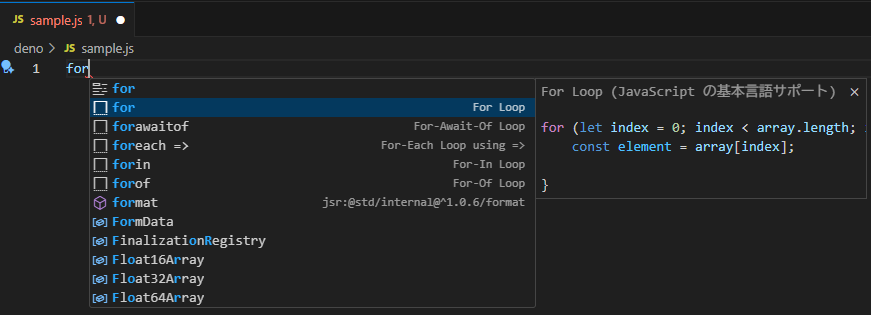
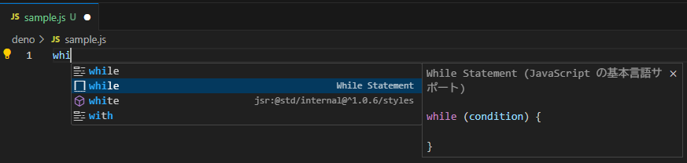
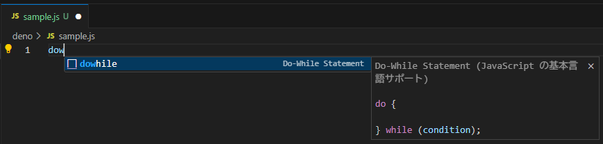
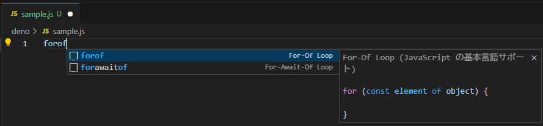

# JavaScript 繰り返し処理とプログラムの制御

## 繰り返し処理とは

**繰り返し処理**（ループ）とは、同じ処理や似たような処理を何度も実行するための仕組みです。プログラミングでは、同じコードを何度も書く代わりに、繰り返し処理を使うことで、コードをシンプルに保ちながら効率的に処理を行うことができます。

日常生活でも私たちは繰り返し処理を行っています：
- 「10回腕立て伏せをする」
- 「全ての商品の合計金額を計算する」
- 「クラスの全員に連絡する」

プログラミングでも同様に、繰り返し処理を使うことで、データの集合に対する操作や、特定の回数だけ処理を実行することができます。

## JavaScriptの繰り返し構文

JavaScriptには、主に3つの基本的な繰り返し構文があります：

1. **for文** - 指定した回数だけ繰り返す
2. **while文** - 条件が真である間、繰り返す
3. **do-while文** - 最低1回は実行し、その後条件が真である間、繰り返す

### for文

`for`文は、最も一般的な繰り返し構文で、特に回数が決まっている場合に使用します。

> [!TIP]
> VSCodeでは `for` と入力してサジェスト（候補）内の `For Loop` を選択（Tabキー押下又はクリック）すると、for文の基本的な構文が自動的に挿入されます。
> 
> ```js
> for (let index = 0; index < array.length; index++) {
>     const element = array[index];
>     
> }
> ```

#### 基本的なfor文の構文

```js
for (初期化; 条件式; 更新式) {
  // 繰り返し実行する処理
}
```

- **初期化**: ループの開始前に1回だけ実行される（通常はカウンタ変数の初期化）
- **条件式**: 各繰り返しの前に評価され、`true`の場合にループ本体が実行される
- **更新式**: 各繰り返しの後に実行される（通常はカウンタ変数の更新）

> [!NOTE]
> 前回（03）で学んだDenoのREPL（日本ではレプルと呼ばれる模様）モードを起動して、以下のコードを用いて動作を確認してみよう。
> ```js
> for (let i = 0; console.log('条件式', i < 10) || i < 10; console.log('更新式', i++)) {
>   console.log('繰り返し実行する処理 i =', i);
> }
> ```

> [!TIP]
> プログラムにおける**式**ってなにもの？
> 参考: [式と演算子 - JavaScript | MDN](https://developer.mozilla.org/ja/docs/Web/JavaScript/Guide/Expressions_and_operators)

#### for文の使用例

```js
// 1から5までの数字を表示
for (let i = 1; i <= 5; i++) {
  console.log(i);
}
// 出力:
// 1
// 2
// 3
// 4
// 5

// 合計値を計算
let sum = 0;
for (let i = 1; i <= 10; i++) {
  sum += i;  // sum = sum + i と同じ
}
console.log("1から10までの合計: " + sum);  // 出力: 1から10までの合計: 55

// カウントダウン
for (let i = 5; i > 0; i--) {
  console.log(i);
}
// 出力:
// 5
// 4
// 3
// 2
// 1
```

#### for文の各部分は省略可能

`for`文の初期化、条件式、更新式はすべて省略可能です：

```js
// 初期化を外部で行う
let i = 0;
for (; i < 3; i++) {
  console.log(i);
}

// 更新を本体内で行う
for (let i = 0; i < 3;) {
  console.log(i);
  i++;
}

// 条件を本体内でチェック（無限ループ + break）
for (let i = 0; ; i++) {
  console.log(i);
  if (i >= 2) break;
}

// すべて省略（無限ループ）
// for (;;) {
//   // 無限に実行される（breakで抜け出す必要がある）
// }
```

### while文

`while`文は、条件が真である限り処理を繰り返します。繰り返し回数が事前に分からない場合に適しています。

> [!TIP]
> VSCodeでは `while` と入力してサジェスト（候補）内の `While Statement` を選択（Tabキー押下又はクリック）すると、while文の基本的な構文が自動的に挿入されます。
> 
> ```js
> while (condition) {
>     
> }
> ```

#### 基本的なwhile文の構文

```js
while (条件式) {
  // 繰り返し実行する処理
}
```

#### while文の使用例

```js
// 1から5までの数字を表示
let i = 1;
while (i <= 5) {
  console.log(i);
  i++;
}

// ユーザー入力に基づく繰り返し（例示のみ）
let answer = "";
while (answer !== "yes") {
  answer = prompt("続けますか？(yes/no)");
  if (answer === "no") {
    console.log("プログラムを終了します");
    break;
  }
}
```

### do-while文

`do-while`文は、`while`文と似ていますが、条件チェックが処理の後に行われるため、最低1回は処理が実行されます。

> [!TIP]
> VSCodeでは `dowhile` と入力してサジェスト（候補）内の `Do-While Statement` を選択（Tabキー押下又はクリック）すると、do-while文の基本的な構文が自動的に挿入されます。
> 
> ```js
> do {
>     
> } while (condition);
> ```

#### 基本的なdo-while文の構文

```js
do {
  // 繰り返し実行する処理
} while (条件式);
```

#### do-while文の使用例

```js
// 1から5までの数字を表示
let i = 1;
do {
  console.log(i);
  i++;
} while (i <= 5);

// 少なくとも1回は実行される例
let count = 10;
do {
  console.log("この文は条件がfalseでも1回は表示されます");
} while (count < 10);
```

## ループの制御

ループの実行を制御するために、`break`と`continue`という2つの重要なキーワードがあります。

### break文

`break`文は、ループを即座に終了し、ループの後の処理に進みます。

```js
// 特定の条件でループを抜ける
for (let i = 1; i <= 10; i++) {
  if (i === 5) {
    console.log("5で終了します");
    break;
  }
  console.log(i);
}
// 出力:
// 1
// 2
// 3
// 4
// 5で終了します
```

### continue文

`continue`文は、現在の繰り返しをスキップし、次の繰り返しに進みます。

```js
// 偶数のみを表示
for (let i = 1; i <= 10; i++) {
  if (i % 2 !== 0) {  // 奇数の場合
    continue;  // 次の繰り返しに進む
  }
  console.log(i);  // 偶数のみ表示される
}
// 出力:
// 2
// 4
// 6
// 8
// 10
```

## 配列と繰り返し処理

配列は、複数の値をまとめて扱うためのデータ構造です。繰り返し処理と組み合わせることで、配列内の全ての要素に対して同じ処理を適用できます。

> [!NOTE]
> 配列の詳細はシラバス08で学習しますが、ここでは繰り返し処理との組み合わせの基本を紹介します。

### 配列の基本

```js
// 配列の宣言と初期化
const fruits = ["りんご", "バナナ", "オレンジ", "ぶどう", "メロン"];

// インデックスを使って要素にアクセス（0から始まる）
console.log(fruits[0]);  // "りんご"
console.log(fruits[2]);  // "オレンジ"

// 配列の長さを取得
console.log(fruits.length);  // 5
```

### for文による配列の処理

```js
const fruits = ["りんご", "バナナ", "オレンジ", "ぶどう", "メロン"];

// 配列の全要素を表示
for (let i = 0; i < fruits.length; i++) {
  console.log(`${i + 1}番目の果物: ${fruits[i]}`);
}
// 出力:
// 1番目の果物: りんご
// 2番目の果物: バナナ
// 3番目の果物: オレンジ
// 4番目の果物: ぶどう
// 5番目の果物: メロン
```

### for...of文

ES6（ECMAScript 2015）から導入された`for...of`文は、配列や他の反復可能なオブジェクトの要素を簡単に繰り返し処理できます。

> [!TIP]
> VSCodeでは `forof` と入力してサジェスト（候補）内の `For-Of Loop` を選択（Tabキー押下又はクリック）すると、for...of文の基本的な構文が自動的に挿入されます。
> 
> ```js
> for (const iterator of object) {
>     
> }
> ```

```js
const fruits = ["りんご", "バナナ", "オレンジ", "ぶどう", "メロン"];

// for...of文で配列の全要素を処理
for (const fruit of fruits) {
  console.log(fruit);
}
// 出力:
// りんご
// バナナ
// オレンジ
// ぶどう
// メロン
```

`for...of`文は、インデックスを気にせずに要素自体に直接アクセスできるため、シンプルで読みやすいコードになります。

## ネストされたループ（多重ループ）

ループの中に別のループを入れることで、多次元のデータ構造を処理したり、複雑なパターンを生成したりすることができます。

### 基本的な多重ループ

```js
// 九九の表を生成
for (let i = 1; i <= 9; i++) {
  for (let j = 1; j <= 9; j++) {
    console.log(`${i} × ${j} = ${i * j}`);
  }
  console.log("-----");  // 各段の区切り
}
```

### 多次元配列の処理

```js
// 2次元配列（行列）
const matrix = [
  [1, 2, 3],
  [4, 5, 6],
  [7, 8, 9]
];

// 全ての要素を表示
for (let i = 0; i < matrix.length; i++) {
  for (let j = 0; j < matrix[i].length; j++) {
    console.log(`matrix[${i}][${j}] = ${matrix[i][j]}`);
  }
}
```

### パターン生成の例

```js
// 星を使った三角形を生成
let pattern = "";
for (let i = 1; i <= 5; i++) {
  for (let j = 0; j < i; j++) {
    pattern += "* ";
  }
  pattern += "\n";  // 改行
}
console.log(pattern);
// 出力:
// * 
// * * 
// * * * 
// * * * * 
// * * * * * 
```

## 無限ループと注意点

無限ループとは、終了条件が満たされず永遠に実行され続けるループのことです。意図的に作成する場合もありますが、多くの場合はプログラムのバグとなります。

### 無限ループの例

```js
// 無限ループの例（実行注意）
// while (true) {
//   console.log("これは永遠に実行されます");
// }

// 条件が常に真になる例（実行注意）
// for (let i = 1; i > 0; i++) {
//   console.log(i);  // iは常に正の値なので、条件は常に真
// }
```

### 無限ループを避けるためのポイント

1. **終了条件を必ず設定する**: ループには必ず終了条件を設け、その条件が最終的に`false`になることを確認する
2. **カウンタ変数の更新を忘れない**: `for`や`while`ループでカウンタを使用する場合、適切に更新する
3. **条件式を慎重に設計する**: 条件式が意図した通りに動作するか確認する
4. **緊急脱出用の`break`を用意する**: 特に複雑な条件の場合、安全のために最大繰り返し回数を設定し、それを超えたら`break`で抜け出す

```js
// 安全な繰り返し処理の例
let count = 0;
const MAX_ITERATIONS = 1000;

while (someComplexCondition()) {
  // 処理
  
  count++;
  if (count > MAX_ITERATIONS) {
    console.log("最大繰り返し回数を超えました");
    break;
  }
}
```

## 実習課題

### 課題1: 基本的なループ操作

`docs/04/work/basic-loops.js`ファイルを作成し、以下の要件を満たすコードを書いてください：

1. `for`ループを使って、1から10までの数字を表示する
2. `while`ループを使って、10から1までカウントダウンする
3. `for`ループを使って、1から20までの偶数のみを表示する（ヒント: `continue`または条件式を工夫する）
4. `do-while`ループを使って、1から5までの数字の二乗を表示する

### 課題2: 配列と繰り返し処理

`docs/04/work/array-loops.js`ファイルを作成し、以下の要件を満たすコードを書いてください：

1. 5つ以上の要素を持つ文字列の配列を作成する
2. `for`ループを使って、配列の全要素を表示する
3. `for...of`ループを使って、配列の全要素を表示する
4. 数値の配列を作成し、`for`ループを使って合計値を計算して表示する
5. 配列内の最大値を見つけて表示する

> [!TIP]
> 適当な配列を思いつ泣かない場合は以下を利用してください
> ```js
> /** @type string[] 都道府県リスト */
> const prefectures = [
>   "茨城県",
>   "栃木県",
>   "群馬県",
>   "埼玉県",
>   "千葉県",
>   "東京都",
>   "神奈川県"
> ];
> /** @type number[] 合計値算出対象配列 */
> const sumList = [
>   50, 11, 1000, 30, -10
> ];
> ```

### 課題3: ネストされたループ

`docs/04/work/nested-loops.js`ファイルを作成し、以下の要件を満たすコードを書いてください：

1. ネストされた`for`ループを使って、以下のような9×9の掛け算表を生成し表示する：
   ```
   01 02 03 04 05 06 07 08 09
   02 04 06 08 10 12 14 16 18
   03 06 09 12 15 18 21 24 27
   04 08 12 16 20 24 28 32 36
   05 10 15 20 25 30 35 40 45
   06 12 18 24 30 36 42 48 54
   07 14 21 28 35 42 49 56 63
   08 16 24 32 40 48 56 64 72
   09 18 27 36 45 54 63 72 81
   ```
2. 以下のようなパターンを出力する：
   ```
   *
   **
   ***
   ****
   *****
   ```
3. 以下のようなパターンを出力する：
   ```
       *
      ***
     *****
    *******
   *********
   ```

> [!NOTE]
> 時間が余ったらfor文のネスト無しで実装ができないか試してみてください。

### 課題4: ループの制御

`docs/04/work/loop-control.js`ファイルを作成し、以下の要件を満たすコードを書いてください：

1. 1から100までの数字の中で、最初に見つかった3と7の両方で割り切れる数を表示する（ヒント: 整数同士のあまりを求める `%` 演算子 `2 % 2 === 0` や `break`を使用）
2. 1から20までの数字を表示するが、3の倍数の場合は数字の代わりに"Fizz"、5の倍数の場合は"Buzz"、両方の倍数の場合は"FizzBuzz"と表示する

## まとめ

- 繰り返し処理は、同じ処理や似たような処理を効率的に実行するための仕組み
- JavaScriptには主に3つの基本的な繰り返し構文がある：`for`文、`while`文、`do-while`文
- `break`文はループを即座に終了し、`continue`文は現在の繰り返しをスキップする
- 配列と繰り返し処理を組み合わせることで、データの集合に対して効率的に処理を行える
- `for...of`文を使うと、配列の要素に簡単にアクセスできる
- ネストされたループを使うことで、多次元のデータ構造を処理したり、複雑なパターンを生成したりできる
- 無限ループを避けるためには、適切な終了条件を設定し、カウンタ変数を正しく更新する必要がある

> [!IMPORTANT]
> 繰り返し処理はプログラミングの基本的な制御構造の一つです。
> 適切な繰り返し構文を選択し、効率的なコードを書くことで、複雑な処理も簡潔に表現できます。
> 次回の授業では、関数定義、引数と戻り値、メソッドについて学習します。
